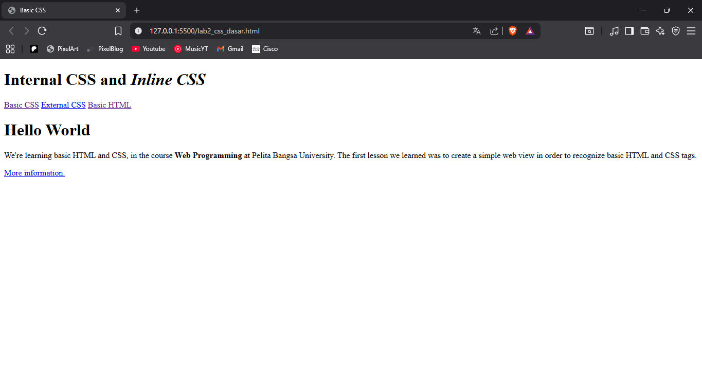
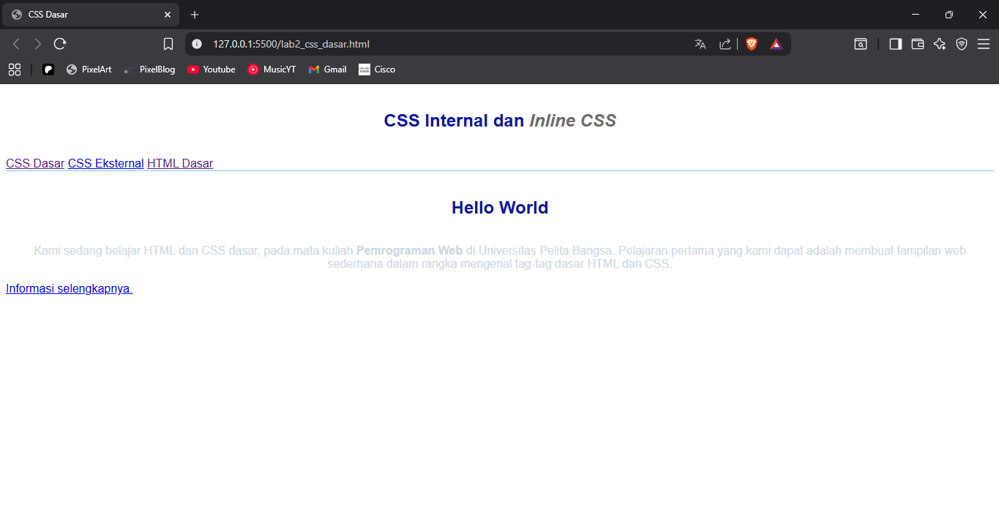
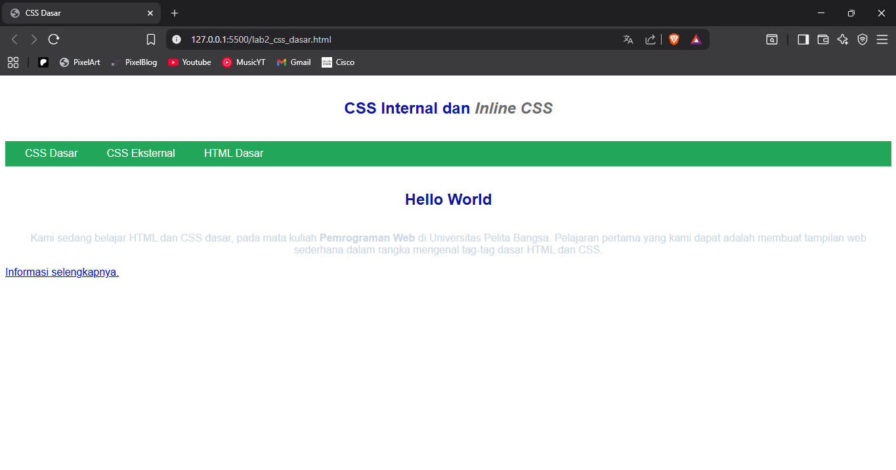
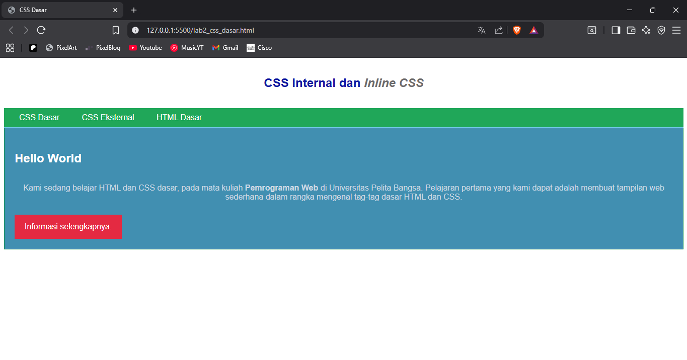

# Laporan Praktikum

## 1. Membuat Dokumen HTML
Dokumen HTML yang terdiri dari struktur dasar HTML5 dengan elemen `<head>` yang berisi informasi meta dan judul halaman, serta `<body>` yang memuat konten utama. Pada bagian `<header>` terdapat judul halaman dan menu navigasi dengan beberapa tautan. Kemudian, bagian konten utama menggunakan `
` yang menunjukkan penggunaan ID Selector untuk membedakan gaya CSS pada bagian tertentu, berisi teks pengantar dan judul tambahan. Selain itu, terdapat juga tautan `<a>` dengan atribut `class="button btn-primary"` yang menunjukkan penggunaan Class Selector, yaitu penanda yang dapat digunakan berulang untuk menerapkan gaya CSS tertentu pada beberapa elemen sekaligus. Dengan kombinasi ID dan Class, kita bisa memberikan pengaturan tampilan yang lebih spesifik pada elemen-elemen HTML.

## 2. Mendeklarasikan CSS Internal
CSS internal yang diletakkan di dalam tag `<style>` pada bagian `<head>` dokumen HTML. Aturannya meliputi: seluruh elemen dalam `<body>` menggunakan font Open Sans dengan fallback sans-serif; elemen `<header>` diberi tinggi minimum 80px dan garis bawah berwarna biru (#77CCEF); elemen `<h1>` diberi ukuran font 24px, warna teks biru tua (#0F189F), rata tengah, serta jarak dalam (padding) 20px atas-bawah dan 10px kiri-kanan; sedangkan elemen `<i>` yang berada di dalam `<h1>` diberi warna abu-abu (#6d6a6b). Dengan aturan ini, tampilan halaman menjadi lebih rapi, tipografi konsisten, dan judul lebih menonjol dengan format terpusat.

## 3. Menambahkan Inline CSS
penggunaan Inline CSS, yaitu menambahkan deklarasi CSS langsung di dalam tag HTML menggunakan atribut style. Deklarasi ini membuat teks paragraf `
` ditampilkan rata tengah (text-align: center) dengan warna teks abu muda kebiruan (#ccd8e4). Inline CSS hanya berlaku untuk elemen yang diberi atribut style tersebut, sehingga lebih spesifik, namun biasanya kurang disarankan untuk proyek besar karena sulit dikelola dibanding CSS internal atau CSS eksternal.

## 4. Membuat CSS Eksternal
CSS eksternal yang digunakan untuk mengatur tampilan elemen `<nav>` dan `<a>` di dalam dokumen HTML. Aturannya: elemen `<nav>` diberi latar belakang hijau tua (#20A759), teks berwarna putih, dan padding 10px; elemen `<a>` di dalam `<nav>` diberi warna teks putih, menghilangkan garis bawah default (text-decoration: none), serta diberi padding 10px atas-bawah dan 20px kiri-kanan; selector nav .active dan nav a:hover membuat link yang aktif atau ketika diarahkan kursor berubah latar belakang menjadi biru gelap (#0B6B3A). Untuk menerapkan aturan ini, file CSS eksternal (misalnya style_eksternal.css) dihubungkan ke HTML menggunakan tag `<link>` di dalam `<head>`, sehingga memisahkan file HTML dan CSS agar lebih terstruktur dan mudah dikelola.

## 5. Menambahkan CSS Selector
- ID Selector (#intro): Digunakan untuk menata elemen dengan id="intro". Aturan di dalamnya memberi latar belakang biru (#418fb1), border 1px berwarna hijau (#099249), tinggi minimum 100px, dan padding 10px. Pada elemen <h1> di dalam #intro, teks diarahkan ke kiri, border dihapus, dan warna teks diubah menjadi putih.
- Class Selector (.button dan .btn-primary): Class .button memberi padding 15px atas-bawah dan 20px kiri-kanan, latar belakang abu-abu (#bebcbd), teks putih, menampilkan elemen sebagai blok sebaris (inline-block), margin 10px, serta menghilangkan garis bawah pada teks link. Class tambahan .btn-primary menimpa latar belakang dengan warna merah (#E42A42).

# Pertanyaan dan Tugas
